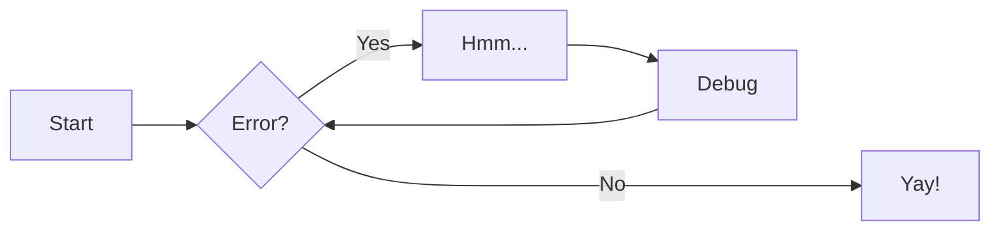
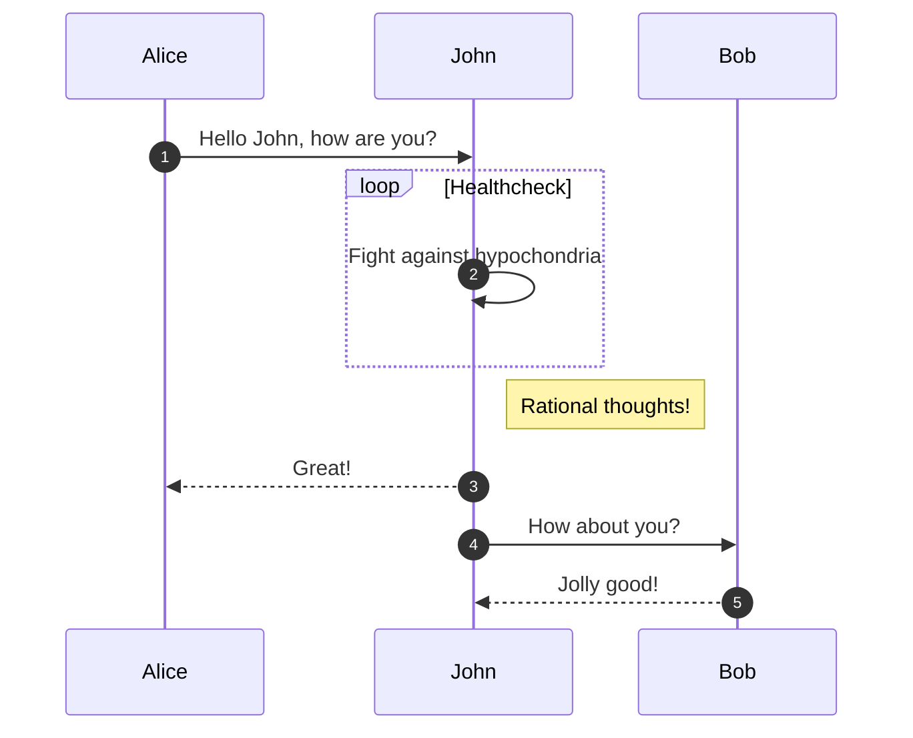
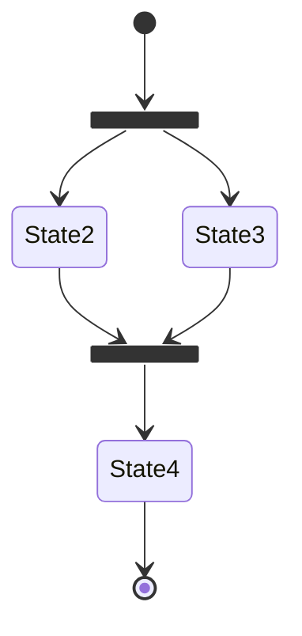
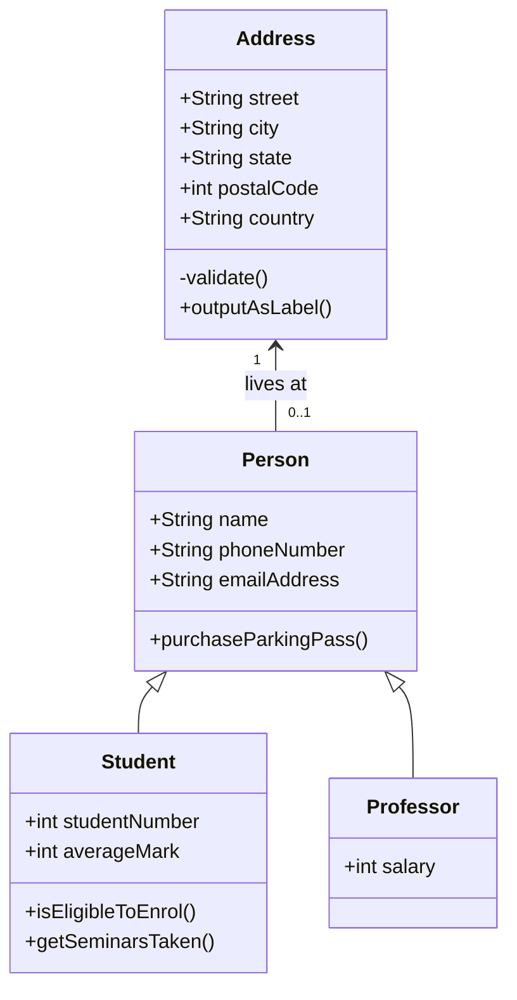

[](https://jitpack.io/#MFlisar/Lumberjack)


This is a full logging library with a build in way to log to **console**, **file** or any **custom** place as well as optional extensions to send a log file via mail or show it on the device.

!!! note "Timber"

    This library fully supports *Jack Whartons* [Timber](https://github.com/JakeWharton/timber) logging library (v4!). And was even based on it until *Lumberjack v6*. Beginning with *v6* I wrote new modules that work without timber which leads to a smaller and more versitile non timber version. I would advice you to use the non timber versions but if you want to you can simply use the timber modules I provide as well - whatever you prefer.

    A short summary on why I went this way can be found [here](README-TIMBER.md)
	
## :frame_photo: :camera: Example Outputs

## :material-check-all: Features

## :link: Dependencies

## :tools: Setup

### :simple-gradle: Gradle

### :material-library: :material-code-tags: Library

## :keyboard: Usage

## :dna: Demo

## :simple-gitextensions: :material-view-module: Modules and Extensions

## :material-professional-hexagon: :green_book: Advanced Usage

## :notepad_spiral: Notes


Lumberjack...

:simple-github:

| Method      | Description                          |
| ----------- | ------------------------------------ |
| `GET`       | :material-check:     Fetch resource  |
| `PUT`       | :material-check-all: Update resource |
| `DELETE`    | :material-close:     Delete resource |

[Subscribe to our newsletter](#){ .md-button }

[Subscribe to our newsletter](#){ .md-button .md-button--primary }

[Send :fontawesome-solid-paper-plane:](#){ .md-button }

```kotlin
class App : Application() {

    override fun onCreate() {
      
      // ------------------------
      // Variant 1: the lumberjack version
      // ------------------------

      // 1) install the implemantion
      L.init(LumberjackLogger)
      
      // 2) install loggers
      L.plant(ConsoleLogger())
      val setup = FileLoggerSetup.Daily(this)
      L.plant(FileLogger(setup))

      // ------------------------
      // Variant 2: the timber version
      // ------------------------

      // 1) install the implemantion
      L.init(TimberLogger)

      // 2) install loggers (trees) 
      Timber.plant(ConsoleTree())
      val setup = FileLoggingSetup.DateFiles(this  )
      Timber.plant(FileLoggingTree(setup))
    }

}
```

``` yaml
theme:
  features:
    - content.code.annotate # (1)
```

1.  :man_raising_hand: I'm a code annotation! I can contain `code`, __formatted
    text__, images, ... basically anything that can be written in Markdown.
	
Lorem ipsum dolor sit amet, (1) consectetur adipiscing elit.
{ .annotate }

1.  :man_raising_hand: I'm an annotation! I can contain `code`, __formatted
    text__, images, ... basically anything that can be expressed in Markdown.

``` yaml
# (1)!
```

1.  Look ma, less line noise!

!!! note "Phasellus posuere in sem ut cursus"

    Lorem ipsum dolor sit amet, consectetur adipiscing elit. Nulla et
    euismod nulla. Curabitur feugiat, tortor non consequat finibus, justo
    purus auctor massa, nec semper lorem quam in massa.
	
??? note

    Lorem ipsum dolor sit amet, consectetur adipiscing elit. Nulla et euismod
    nulla. Curabitur feugiat, tortor non consequat finibus, justo purus auctor
    massa, nec semper lorem quam in massa.
	
???+ note

    Lorem ipsum dolor sit amet, consectetur adipiscing elit. Nulla et euismod
    nulla. Curabitur feugiat, tortor non consequat finibus, justo purus auctor
    massa, nec semper lorem quam in massa.
	
!!! warning annotate "Phasellus posuere in sem (1) ut cursus"

    Lorem ipsum dolor sit amet, consectetur (2) adipiscing elit. Nulla et
    euismod nulla. Curabitur feugiat, tortor non consequat finibus, justo
    purus auctor massa, nec semper lorem quam in massa.

1.  :man_raising_hand: I'm an annotation!
2.  :woman_raising_hand: I'm an annotation as well!

=== "Tab 1"

    Lorem ipsum dolor sit amet, consectetur adipiscing elit.

=== "Tab 2"

    Phasellus posuere in sem ut cursus (1)

``` py linenums="1"
def bubble_sort(items):
    for i in range(len(items)):
        for j in range(len(items) - 1 - i):
            if items[j] > items[j + 1]:
                items[j], items[j + 1] = items[j + 1], items[j]
```

``` py title="bubble_sort.py"
def bubble_sort(items):
    for i in range(len(items)):
        for j in range(len(items) - 1 - i):
            if items[j] > items[j + 1]:
                items[j], items[j + 1] = items[j + 1], items[j]
```

``` py hl_lines="2 3"
def bubble_sort(items):
    for i in range(len(items)):
        for j in range(len(items) - 1 - i):
            if items[j] > items[j + 1]:
                items[j], items[j + 1] = items[j + 1], items[j]
```











