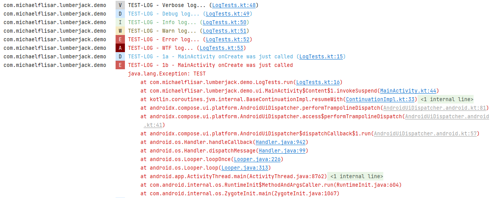
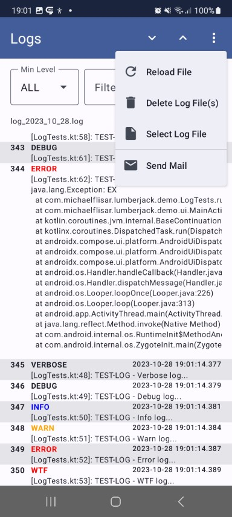
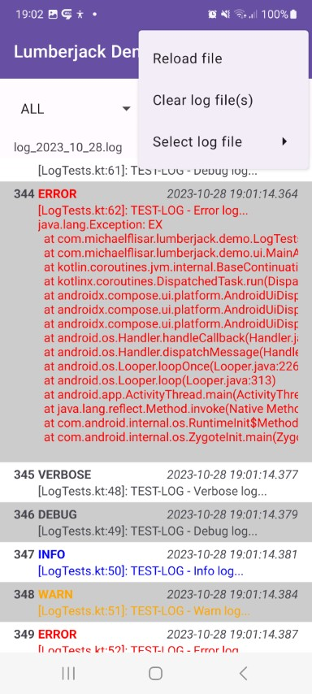



<i>This is a **full logging library** with a build in way to log to **console**, **file** or any **custom** place as well as optional extensions to send a log file via mail or show it on the device.</i>

!!! info-primary "Information"

    The complete library is **modularized** so that you can add just add those parts of it that you are interested in.

??? info-primary "Timber Support"

    This library fully supports *Jack Whartons* [Timber](https://github.com/JakeWharton/timber){target=_blank} logging library (v4!). And was even based on it until *Lumberjack v6*. Beginning with *v6* I wrote new modules that work without timber which leads to a smaller and more versitile non timber version. I would advice you to use the non timber versions but if you want to you can simply use the timber modules I provide as well - whatever you prefer.

    ??? info-primary "Why did I do this?"

        I decided to not use `Timber` myself anymore because of following reasons:

        * `Timber` does explicitly rely on non lazy evaluating logging - it was a decision made by *Jack Wharton* and was the main reason to write `Lumberjack` at the beginning
        * `Timber` is restrictive regarding class extensions - in v5 I would need access to a field to continue supporting timber in `Lumberjack`
        * `Timber` is considered as working and feature requests and/or pull requests are not accepted if not really necessary - like e.g. my minimal one [here](https://github.com/JakeWharton/timber/issues/477).
        * additionally I always needed to extend the `BaseTree` from `Timber` because of the limiting restrictions of the default `BaseTree` as well as it was to restrictive to make adjustment in it ( I always had a nearly 1:1 copy of it inside my library [here](https://github.com/MFlisar/Lumberjack/blob/595d4de0ae76338e66cf42f7324f51c945699fa8/library/implementations/timber/src/main/java/timber/log/BaseTree.kt#L9){target=_blank}). This was needed to allow to adjust the stack trace depth so that `Lumberjack` will log the correct calling place as a wrapper around `Timber`.

        **This lead to my final decision**

        `Lumberjack` does not need `Timber` and I provide a way to plug in `Timber` into `Lumberjack` now - this way using `Timber` and `Lumberjack` in combination is possible but not necessary anymore.
	
## :camera: Example Outputs

| Console | |
|-|-|
|  |  |

| File |
|-|
| [Example log file](../files/lumberjack/log.txt) |

| Compose Viewer | | View Viewer | |
|-|-|-|-|
|  |  |  |  |

## :material-check-all: Features

* logs will be created with **class name**, **function name** abd **line number** of the calling place automatically
* logs are evaluated lazily, this means, if the content of a log is not needed, it won't be evaluated
* loggers can be *enabled*/*disabled*  and do support filtering logs
* supports arbitrary loggers by implementing a single function based interface
* can be used with a very small custom logging implementation or timber (whatever you prefer)
* has extensions for
    * sending a log file via mail (no internet permissions - this is done by appending the log file to an `Intent` and let the user choose an email client)
    * a log file viewer (view or compose based)
    * a notification extension which allows you to show a notification which can show a non crashing but unexpected error and allows the user to click it and send a log file if desired

**All features are splitted into separate modules, just include the modules you want to use!**

## :link: Dependencies

| Modules | Dependency | Version |
|:-|:-|-:|
| `core` | - |  |
| **Lumberjack Loggers** {: colspan=3 style="background-color:var(--md-primary-fg-color--light);"} | &#8288 {: style="padding:0"} | &#8288 {: style="padding:0"} |
| `implementation-lumberjack` | - |  |
| `logger-console` | - |  |
| `logger-file` | - |  |
| **Timber Loggers** {: colspan=3 style="background-color:var(--md-primary-fg-color--light);"} | &#8288 {: style="padding:0"} | &#8288 {: style="padding:0"} |
| `implementation-timber` | [Timber](https://github.com/JakeWharton/timber){target=_blank} | `4.7.1` |
| `logger-timber-console` | [Timber](https://github.com/JakeWharton/timber){target=_blank} | `4.7.1` |
| `logger-timber-file` | [Timber](https://github.com/JakeWharton/timber){target=_blank} | `4.7.1` |
| | [slf4j](https://www.slf4j.org/){target=_blank} | `2.0.7` |
| | [logback-android](https://github.com/tony19/logback-android){target=_blank} | `3.0.0` |
| **Common Extensions** {: colspan=3 style="background-color:var(--md-primary-fg-color--light);"} | &#8288 {: style="padding:0"} | &#8288 {: style="padding:0"} |
| `extension-feedback` | [FeedbackManager](https://github.com/MFlisar/FeedbackManager){target=_blank} | `2.0.3` |
| `extension-notification` | [FeedbackManager](https://github.com/MFlisar/FeedbackManager){target=_blank} | `2.0.3` |
| `extension-viewer` | [FastScroller](https://github.com/quiph/RecyclerView-FastScroller){target=_blank} | `1.0.0` |
| | [FeedbackManager](https://github.com/MFlisar/FeedbackManager){target=_blank} | `2.0.3` |
| `extension-composeviewer` | [FeedbackManager](https://github.com/MFlisar/FeedbackManager){target=_blank} | `2.0.3` |

Following dependency only applies to the **extension-composeviewer** module:

| Dependency | Version | Infos |
|:-|-:|:-:|
| [Compose BOM](https://developer.android.com/jetpack/compose/bom/bom){target=_blank} | `2023.10.01` | [Mapping](https://developer.android.com/jetpack/compose/bom/bom-mapping){target=_blank} |
| Material3 | `1.1.2` | |

## :simple-gradle: Setup Gradle



## :material-code-tags: Setup Library

=== "Lumberjack Version"

    ```kotlin
    class App : Application() {

        override fun onCreate() {

             // 1) install the implemantion
             L.init(LumberjackLogger)
             
             // 2) install loggers
             L.plant(ConsoleLogger())
             val setup = FileLoggerSetup.Daily(this)
             L.plant(FileLogger(setup))
        }

    }
    ```
    
=== "Timber Version"

    ```kotlin
    class App : Application() {

        override fun onCreate() {
          
             // 1) install the implemantion
             L.init(TimberLogger)
             
             // 2) install loggers (trees) 
             Timber.plant(ConsoleTree())
             val setup = FileLoggingSetup.DateFiles(this  )
             Timber.plant(FileLoggingTree(setup))
        }

    }
    ```

## :keyboard: Usage

???+ code "Logging"

    ```kotlin
    // wherever you want use one of L.* functions for logging
    // all the functions are implemented as inline functions with lambdas - this means,
    // everything inside the lambda is only executed if the log is really ussed

    L.d { "a debug log" }
    L.e { "a error log" }
    L.e(e)
    L.e(e) { "an exception log with an additonal message" }
    L.v { "TEST-LOG - Verbose log..." }
    L.d { "TEST-LOG - Debug log..." }
    L.i { "TEST-LOG - Info log..." }
    L.w { "TEST-LOG - Warn log..." }
    L.e { "TEST-LOG - Error log..." }
    L.wtf { "TEST-LOG - WTF log..." }

    // optional tags work like following
    L.tag("LEVEL").d { "Tagged log message..." }

    // you can log something optionally like following
    L.logIf { false }?.d { "This will never be logged because logIf evaluates to false..." }

    // manual log levels
    L.log(Level.DEBUG) { "Debug level log via L.log instead of L.d" }
    ```

???+ code "Filtering Logs"

    === "Lumberjack Version"

        ```kotlin
        // typealias LumberjackFilter = (level: Level, tag: String?, time: Long, fileName: String, className: String, methodName: String, line: Int, msg: String?, throwable: Throwable?) -> Boolean
        val filter = object : LumberjackFilter {
            override fun invoke(
                level: Level,
                tag: String?,
                time: Long,
                fileName: String,
                className: String,
                methodName: String,
                line: Int,
                msg: String?,
                throwable: Throwable?
            ): Boolean {
                // decide if you want to log this message...
                return true
            }
        }
        // the filter can then be attached to any logger implementation
        val consoleLogger = ConsoleLogger(filter = filter)
        val fileLogger = FileLogger(filter = filter)
        ```

    === "Timber Version"

        !!! info-primary "Lumberjack Version"

            The lumberjack implementation allows you more granular filter options as well as a custom filter for each logger implementation!

        ```kotlin
        TimberLogger.filter = object: IFilter {
            override fun isTagEnabled(baseTree: BaseTree, tag: String): Boolean {
                // decide if you want to log this tag on this tree...
                return true
            }
            override fun isPackageNameEnabled(packageName: String): Boolean {
                // decide if you want to log if the log comes from a class within the provided package name
                return true
            }
        }
        ```

???+ code "Other settings"

    ```kotlin

    // if desired you can enable/disable all logs completely 
    // e.g. in a release build like following 
    // => you probably would want to do this inside the application after the init of Lumberjack
    L.enable(BuildConfig.DEBUG)

    // Alternatively every logger does support an enabled flag as well
    val consoleLogger = ConsoleLogger(enabled = BuildConfig.DEBUG)
    val fileLogger = FileLogger(enabled = !BuildConfig.DEBUG, ...)

    ```

## :dna: Demo



## :material-view-module: Modules and Extensions

Depending on your preferences you must decide yourself if you want to use the timber modules or the non timber modules. My suggestion is to prefer the non timber modules as those will save some space and will allow you to even log in a more flexible way. Despite that, all extensions work with any implementation (timber or non timber one)

### 1) Extension Feedback

This small extension simply allows you to send a log file via mail (no internet connection required). This will be done by sharing the file as email `Intent`.

???+ code "Send feedback"

    ```kotlin
    L.sendFeedback(
        context, 
        <file-logging-setup>.getLatestLogFiles(), 
        "some.mail@gmail.com"
    )
    ```

### 2) Extension Notification

This small extension provides you with with a few functions to create notifications (for app testers or for the dev for example) that can be clicked and then will allow the user to send the log file to you via the `extension-feedback`. Or to open the log file by clicking the notification.

???+ code "Show notifications"

    ```kotlin
    // show a crash notifcation - on notification click 
    // the user can send a feedback mail including the log file
    L.showCrashNotification(
        context: Context,
        logFile: File?,
        receiver: String,
        appIcon: Int,
        notificationChannelId: String,
        notificationId: Int,
        notificationTitle: String = "Rare exception found",
        notificationText: String = "Please report this error by clicking this notification, thanks",
        subject: String = "Exception found in ${context.packageName}",
        titleForChooser: String = "Send report with",
        filesToAppend: List<File> = emptyList()
    )
    
    // show an information notification to the user (for app tester or dev purposes)
    // clicking it could send an email or open the log viewer or whatever...
    fun L.showInfoNotification(
        context: Context,
        notificationChannelId: String,
        notificationId: Int,
        notificationTitle: String,
        notificationText: String,
        notificationIcon: Int,
        clickIntent: Intent? = null,
        apply: ((builder: NotificationCompat.Builder) -> Unit)? = null
    )
    ```

### 3) Extension ComposeViewer

If you use compose in your app you should use this viewer - it allows you to show log files directly inside your app.

???+ code "Compose Dialog"

    ```kotlin
    val showLogViewer = rememberSaveable {
        mutableStateOf(false)
    }
    LumberjackDialog(
        visible = showLogViewer,
        title = "Logs",
        setup = <a file logging setup>,
        mail = "some.mail@gmail.com"
    )
    ```

| Compose Viewer | |
|-|-|
|  |  |

### 4) Extension Viewer

If you do not use compose, here's a view based alternative to show log files inside your app.

???+ code "View Activity"

    ```kotlin
    // show the log viewer activity (mail address is optional, 
    // if it's null, the send mail entry will be removed from the viewers menu)
    L.showLog(
        context, 
        fileLoggingSetup, 
        "some.mail@gmail.com"
    )
    ```

| Viewer | |
|-|-|
|  |  |

## :material-professional-hexagon: Advanced Usage

Either use the timber version and plug in your custom loggers into timber (*check out timber for that please*) or simply plug in a custom logger into lumberjack directly if you do not use the timber solution like following - all you need to do is implementing a single function and then add your logger to `Lumberjack` (following example is the current `ConsoleLogger` implementation).

???+ code "Custom Logger Example"

    ```kotlin
    class ConsoleLogger(
        override var enabled: Boolean = true,
        override val filter: LumberjackFilter = DefaultLumberjackFilter
    ) : ILumberjackLogger {

        override fun log(
            level: Level,
            tag: String?,
            time: Long,
            fileName: String,
            className: String,
            methodName: String,
            line: Int,
            msg: String?,
            throwable: Throwable?
        ) {
            val link = "(${fileName}:${line})"
            val log = listOfNotNull(
                msg,
                link.takeIf { throwable == null },
                throwable?.stackTraceToString()?.let { "\n$it" }
            ).joinToString(" ")
            Log.println(level.priority, tag, log)
        }

    }
    ```

That's all. You can do the logging asynchronous as well if you want - just do whatever you want inside your logger implementation.

## :notepad_spiral: Notes

### File Loggers

There's something to say about file loggers. The `timber` version uses `slf4j` + `logback-android` which adds quite some overhead to your app. But those libraries are well tested and solid.

Beginning with v6 I decided to also provide non timber versions of my library and the file logger for this one does not have any dependencies - it simply logs in a background thread with the help of coroutines. This makes this alternative very tiny.
